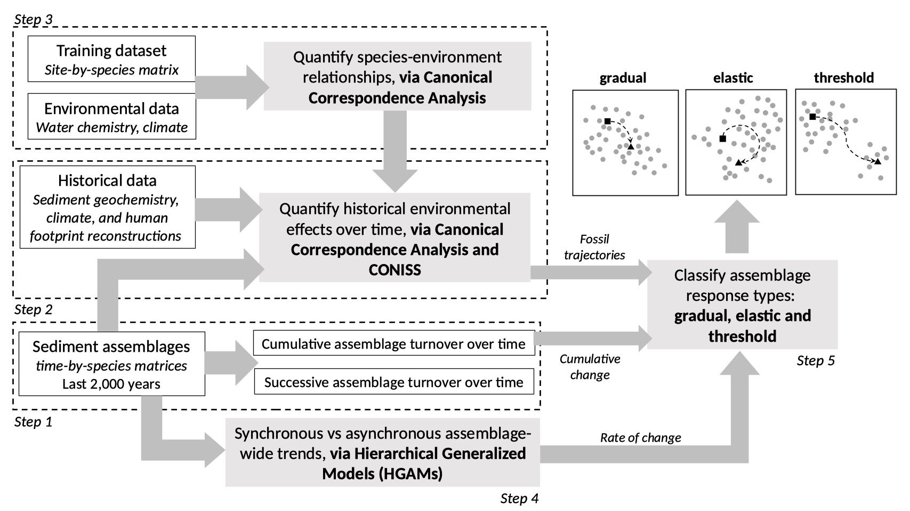

# Quantifying diatom paleolimnological resilience

Code and data for generating the main results and plots of the manuscript **Ecological resilience of tropical Andean lakes: a paleolimnological perspective** 
Accepted in Limnology & Oceanography's Special Issue Nonlinear dynamics

### Repository structure
1. **R scripts**: codes for running all the statistical analyses in a logical order
2. **Data**: raw datasets (diatom sediment and training set abundances, lakes' environmental data, and geochemical proxies), and secondary data matrices resulting from primary statistical analyses in <i>R scripts</i>
3. **Figures**: plots resulting from analyses in <i>R scripts</i>

### Methodological framework to characterize diatom community responses 
</img>